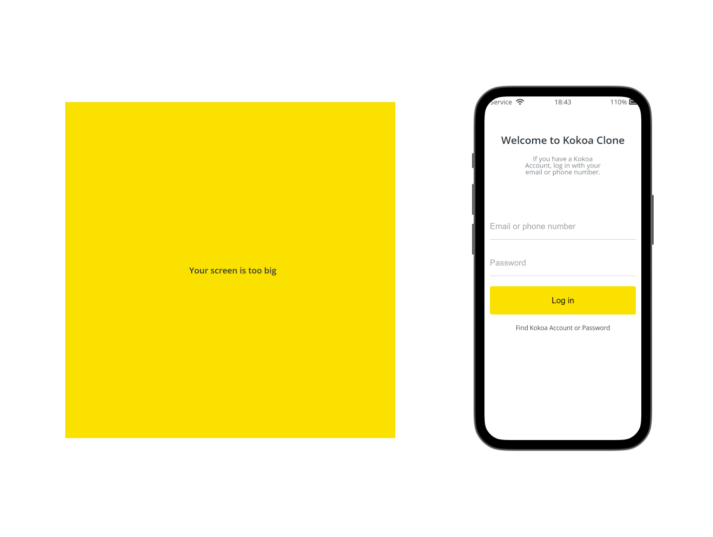
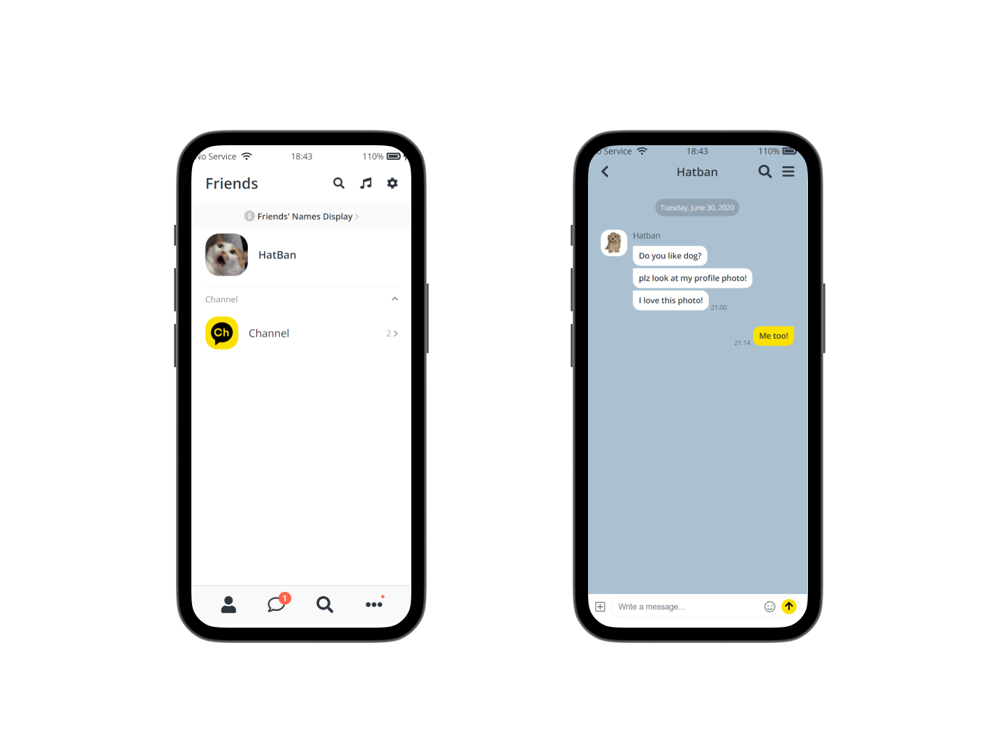
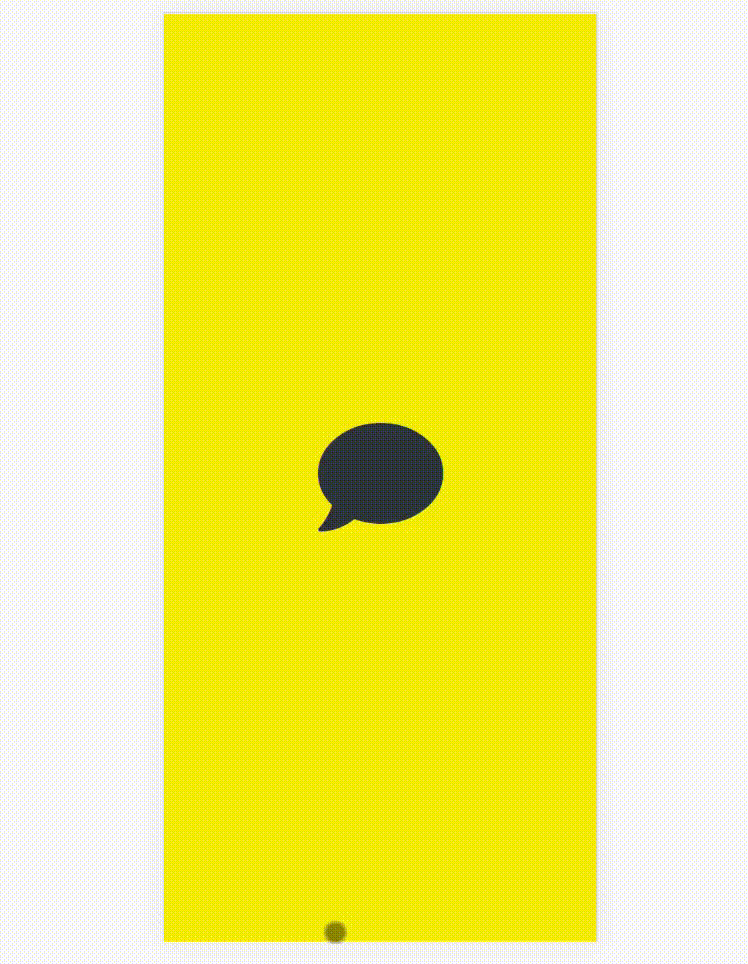

# 카카오톡 클론코딩
html/css 연습을 위한 카카오톡 클론코딩
 

 

# ⌛ 제작 기간
2021년 9월 2일 ~ 2021년 9월 6일(총 4일)

 

# ⚙ 사용 기술 및 라이브러리
- `HTML / CSS`

 

# 🛠 주요기능
<h3>1. 반응형 사이즈 </h3>

- 카카오톡이 어플리케이션인점을 고려해서 645px이하는 media query를 통해 css로 반응형처리를 했습니다
- js를 이용하지 않고 css만을 이용해 만들어 no-mobile이라는 div를 따로 만들어 display:none을 통해 처리했습니다

<h3>2. 자주 사용하는 css효과 변수화 </h3>

- 자주 사용하는 메인컬러 및 css효과는 variables.css에 변수화해서 재사용

<h3>2. 다양한 아이콘 애니메이션 </h3>

- css의 trnaform을 이용해 회전하는 효과, 화면이 자연스럽게 전환되게 하기 등의 애니메이션을 적용

 

 
 

#  🖥 사이트
https://hatbann.github.io/kokoa-clone/

